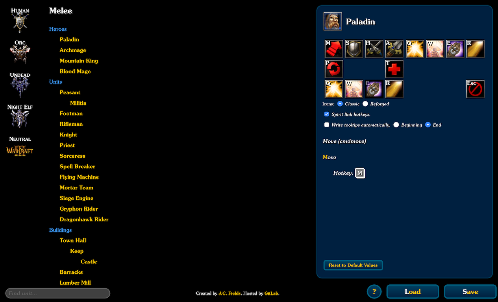

# warcraft3-hotkey-editor

A [hotkey editor for *Warcraft III*](https://jcfieldsdev.github.io/warcraft3-hotkey-editor/). Written in JavaScript. Includes all units and structures from standard multiplayer and the official campaigns. In addition to editing hotkeys, it also allows editing tooltip text with a simplified syntax and repositioning buttons by drag-and-drop.

## Guide

### Finding units

Select a multiplayer race using the faction icons on the left edge. This shows a list of all heroes, units, and buildings associated with that race. The standard multiplayer units are sorted under **Melee**, and special campaign units are sorted under **Campaign**. The four campaign-only races—the Blood Elves, Draenei, Demons, and Naga—are sorted under the Humans, Orcs, Undead, and Night Elves respectively.

There is also an icon for neutral units. As in the map editor, neutral units are sorted between **Neutral Passive**—neutral heroes and shops—and **Neutral Hostile**—creeps and hireable mercenaries.

You can also use the search box in the bottom-left of the page to search for a particular unit by name. You can use the `Up` and `Down` arrow keys to scroll through the search results and press `Enter` to select a unit, or you can select the desired unit by clicking on it.

### Editing hotkeys

Once a unit has been selected, its associated commands appear in the editor view on the right side of the screen. Heroes also display their "Hero Abilities" commands and workers display their "Build Structure" commands in an adjacent command card.

Clicking a command button in one of the command cards brings up all of the tooltips and hotkeys for that command (as well as the name of the command with its editor code in parenthesis). The hotkey currently being edited is highlighted with a white border. Any letter key can be used as a hotkey by pressing the desired key while the box is highlighted.

If there is more than one hotkey for the command, there will be multiple boxes. Hotkey groups have labels that indicate their purpose: "Hotkey" for standard hotkeys, "Unhotkey" for hotkeys that disable two-state abilities (such as "Defend"), and "Researchhotkey" for hotkeys that select hero abilities.

Additionally, some hotkeys also have multiple levels of hotkeys (such as weapons and armor upgrades and spellcaster training upgrades). These are placed beside each other on the same line and can be edited separately.

The *Spirit link hotkeys* option sets all hotkeys for a command simultaneously, which makes it easier to modify commands with multiple hotkeys. This option is smart enough not to modify commands together when they could potentially conflict with each other (such as the Town Hall's "Call to Arms"/"Back to Work" hotkeys, which can appear together on the same command card).

The hotkey of a command appears over its button in the command card. If there is a hotkey conflict, the hotkeys of the conflicting commands are highlighted in red. Conflicts are automatically detected as you edit hotkeys. Additionally, units with conflicting commands are highlighted in red in the list of units so units with hotkey conflicts can quickly be identified. Note there are a few units that have hotkey conflicts by default (such as Chen Stormstout).

The bottom of the editor has a couple of additional options:

- "Show Units with Command" shows all units with the same command (and therefore which units are affected by changing the hotkey for the command). Note that there are many abilities that have multiple commands with different editor codes (usually because of different versions for creeps); units are only shown here if they use the exact same command.
- "Reset to Default Values" resets all hotkeys, tooltips, and button positions for the current command to their default values.

### Editing tooltips

Tooltips can be edited by clicking on them. Hotkeys and levels can be highlighted in yellow text by surrounding their text in `*asterisks*`. Secondary tip text can be written in `^carets^`. These are automatically be converted to their proper mark-up by the editor.

You can also use the game's special mark-up for text color (e.g., `|cffffcc00your text here|r`) if you want to use a specific hex color. Note that the first byte for the alpha channel is ignored by the game and will always be written as `ff` by the editor (regardless of what value you specify).

Due to a limitation of the *Warcraft III* hotkey file format, tooltips cannot contain quotation marks.

Hero abilities and upgrades with multiple levels have each level separated by a line break. An ability with three levels, for instance, needs a tooltip three lines long. The tooltip for researching a hero ability uses the format specifier `%d` to represent the next level of the command.

The *Write tooltips automatically* option automatically rewrites all of the tooltips for the command when you change its hotkey to indicate its new hotkey. This option is disabled by default because *Warcraft III Reforged* made two changes to how tooltips are handled: hero commands can no longer have their tooltips modified and all commands automatically have their hotkey displayed after their tooltip.

The "Reset to Default Values" button at the bottom of the editor also resets tooltips to their default values.

### Repositioning buttons

Buttons can be repositioned by dragging and dropping them. If dropped onto an empty space, the button is relocated there. If dropped onto another button, both buttons swap positions. If you hold the `Shift` key while dropping a button onto another button, this behavior is overridden and the new button is placed in the same position as the old one (causing a position conflict).

Buttons with position conflicts have a red border around them. Position conflicts don't necessarily need to be fixed; the game and the editor both reposition a button where there is room for it in the case of a position conflict. Some creeps have position conflicts in their abilities by default.

The "Reset to Default Values" button at the bottom of the editor also resets button positions to their default values.

### Loading and saving

You can load your existing hotkey profile by clicking the `Load` button in the bottom-right corner of the screen. This brings up an overlay with the following functionality:

- You can load an existing hotkey set by selecting it from the dropdown menu and then clicking the `Open` button.
- You can load a hotkey file from your computer under "Load local file." This imports its contents into the text box. Click the `Open` button to load it into the hotkey editor.
- You can copy and paste the contents of a hotkey file directly into the text box and click the `Open` button to load it.
- The `Reset` button resets all hotkeys to their default values.

After customizing your hotkeys, click the `Save` button in the bottom-right corner of the screen to generate a new hotkey file based on your modifications. You can copy the contents of this file by directly copying from the text box or by clicking the `Copy` button, or you can download the file by clicking the `Download` button.

If you've changed any options, they'll be stored in your hotkey file under the `hotkeyeditorpreferences` section. This section is safely ignored by the game, but the editor uses it to reload your preferences the next time you use it.

The `?` button next to the `Load` and `Save` buttons brings up the [help page](https://jcfieldsdev.github.io/warcraft3-hotkey-editor/help.html), which explains in detail where the hotkey file is located on your computer and how to enable it in the game.

## Limitations

- The icon order algorithm may not be exactly the same as the game in cases where there are button position conflicts (which, by default, includes several creeps).
- There are some special creeps and other units in the campaign that can potentially be player-controlled (through mind control abilities or otherwise) that may not be available in the editor, though their commands are typically present in the standard multiplayer creeps.

## Acknowledgments

Used [RivSoft's Warcraft III data viewer](https://wc3.rivsoft.net/) for data and assets and [WTii's unit tester map](https://www.hiveworkshop.com/threads/wtiis-unit-tester.239333/) for testing.

Uses [Space Mono](https://github.com/googlefonts/spacemono) font by Colophon Foundry.

Includes [QWEASZ hotkey set](https://www.reddit.com/r/WC3/comments/69p3nv/improved_custom_hotkeys_setup_by_wtvr/) by wtvr.

## Authors

- J.C. Fields <jcfields@jcfields.dev>

## License

- [MIT license](https://opensource.org/licenses/mit-license.php)

## See also

- [*Starcraft II* Hotkey Editor](https://github.com/jcfieldsdev/starcraft2-hotkey-editor)—A similar editor derived from this project.
